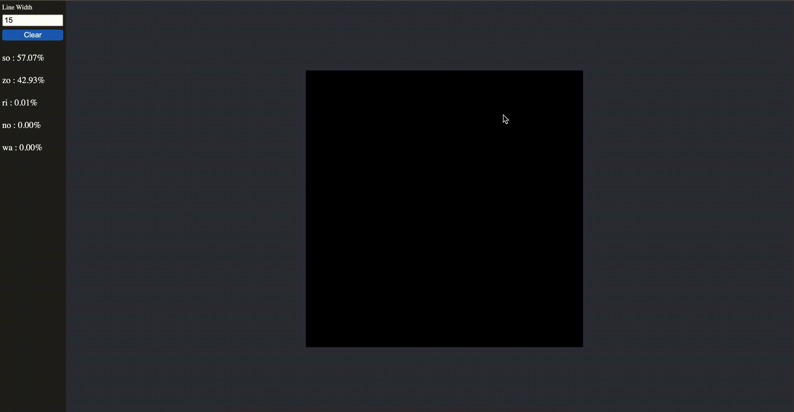

  <h1 align="center">KanaReader</h1>
  
Web browser app that recognize the kana that you draw

---

**This is an unofficial project solely intended for personal learning and research about deep learning**

- **The accuracy is poor because it wasn't trained on a lot of data**

## Demo

    

## How to use it ?

Go in the app folder 

    `$ cd app`

Then type 

    `$ http-server`

This will create a local website available at the address in your terminal

## Features

Draw the kana into the canva, the top five results will appear in the sidebar with their probabilities to be the kana.

## Training

- I used the [7500-unique-kana-image](https://github.com/Orzelius/7500-unique-kana-images) dataset to train the model.

- The code to train the model is **kanaReader.ipynb** notebook

## Scripts

I created 2 python scripts : 
- One to put each kana in the folder of his category
- One to create a validation dataset 

---

